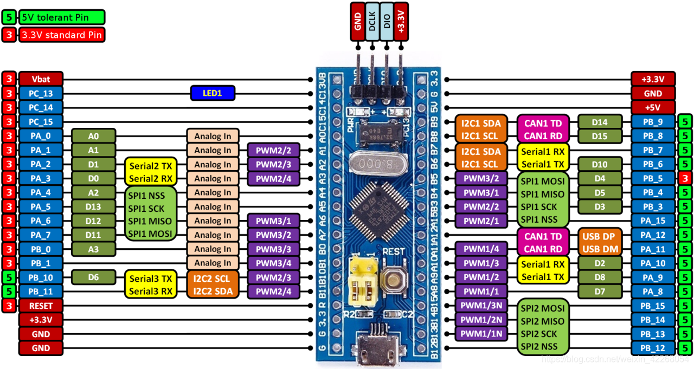
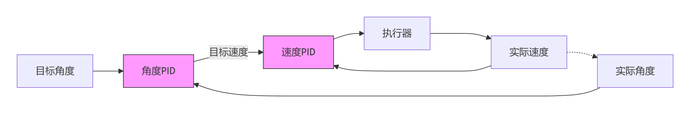

# 程序主入口
`Core\Src\main.c`

# 启动烧录
# 全部执行（先构建再烧录）
```bash
./run.sh

# 全部执行（Debug模式）
./run.sh debug

# 仅构建
./run.sh build

# 仅构建（Debug模式）
./run.sh build debug

# 仅烧录
./run.sh flash

# 仅烧录指定文件
./run.sh flash path/to/firmware.hex

# 清理构建文件
./run.sh clean
```


# 引脚图
以下是STM32F103C8T6引脚图


# 增加Utils部分

在`Utils/`下创建控制模块

在根目录下的CMakeLists.txt下修改如下
```diff
target_include_directories(${CMAKE_PROJECT_NAME} PRIVATE
    # Add user defined include paths
+    Utils
)
```

# 增加浮点数打印
在根目录下`CMakeLists.txt` 增加

```diff
+ target_link_options(${CMAKE_PROJECT_NAME} PRIVATE
+     -u _printf_float
+ ) 
```
添加链接选项以支持浮点数打印

# 元器件要外部供电！

# 函数命名规范
`main`函数中注释一定要规范！变量注释如下
```C
/* The variables about GRYO is declared here */

volatile uint8_t gyro_sample =0; // How many seconds to read data
WIT_Data_t gyro_data={0}; // This is data that store the gyro data

/* This is the end of declaration */
```
> 函数注释和规范如下
```C
/* Timer interruption is created here. Don't delete it!!! */
void HAL_TIM_PeriodElapsedCallback(TIM_HandleTypeDef *htim)
{
  // All Timed Tasks Need to be marked here!!!
  if (htim == &htim2)
  {
    if (update_attitude_flag < 199)
    {
      update_attitude_flag++;
    }
  }
}
/* Don't Move This Code!!! */
```
**<mark>一定要写在给出的`cubemx`不会改变的地方！</mark>**

# 一些Trick

## PID 调节思路
该思路其实是`copilot`给出的,感谢伟大的AI！
下面我将对级联pid做出一些解释，级联PID示意图如下：

我们可以在main函数中直接调用阶梯状升级的速度，即用`PID_SetTarget`这样我们就可以看出速度调节是否有效，临时测试代码
```C
// 在main函数中添加测试代码
void Test_SpeedPID_Tuning(void)
{
    static uint32_t test_timer = 0;
    test_timer++;
    
    // 每2秒切换一次目标速度，测试阶跃响应
    if (test_timer % 2000 == 0) {
        static float test_speeds[] = {0, 50, 100, -50, -100};
        static uint8_t speed_index = 0;
        
        float target_speed = test_speeds[speed_index];
        PID_SetSpeed(PID_MOTOR_A, target_speed);
        PID_SetSpeed(PID_MOTOR_B, target_speed);
        
        printf("Target Speed: %.1f RPM\r\n", target_speed);
        speed_index = (speed_index + 1) % 5;
    }
}
```